# Final Assessment for Springer DevOps Internship

1. **Git and Python Script (hello.py)**

Prints out Hello, DevOps! to the console. To run the script, use the following command:
```
python hello.py
```

2. **Linux and bash scripting (scripts/sysinfo.sh)**

This script displays the user information, date/time and disk usage of the system. 
To run the script, use the following command:
```
./scripts/sysinfo.sh
```
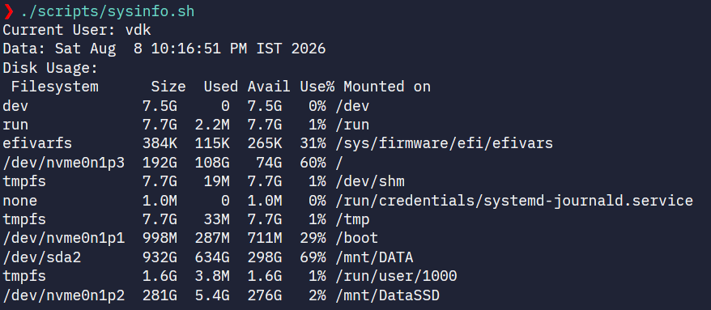

3. **Dockerfile**

This file creates the Docker image for the application. To build the Docker image, use the following command:
```
docker build -t devops-hello .
```
To run the Docker container, use the following command:
```
docker run --rm devops-hello
```
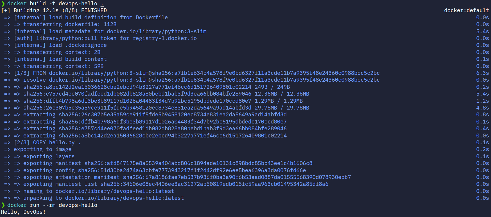

4. **CI/CD with GitHub Actions**

The GitHub Actions workflow is defined in `.github/workflows/ci.yml`
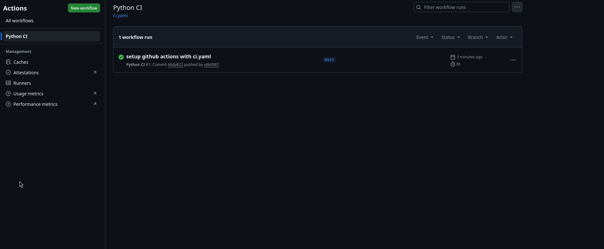
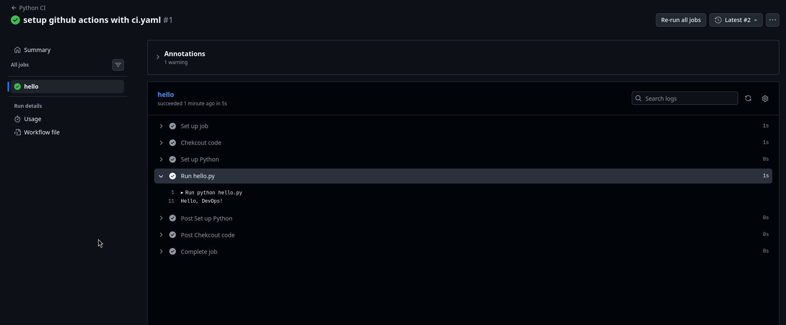

5. **Job deployment with Nomad (nomad/hello.nomad)**

- **Nomad job file is created (nomad/hello.nomad)**
- **Nomad Dev Agent is started using the command:**
```
sudo nomad agent -dev
```
- **Job is validaed using the command:**
```
nomad job validate nomad/hello.nomad
```
- **Job is run using the command:**
```
nomad job run nomad/hello.nomad 
```
- **Job status is checked using the command:**
```
nomad job status hello-devops
```
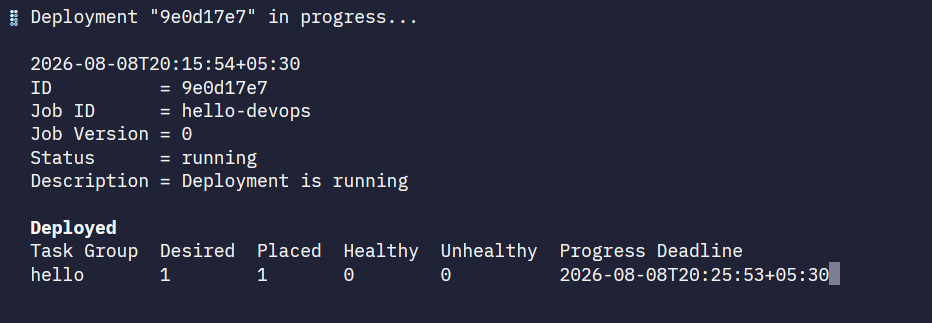
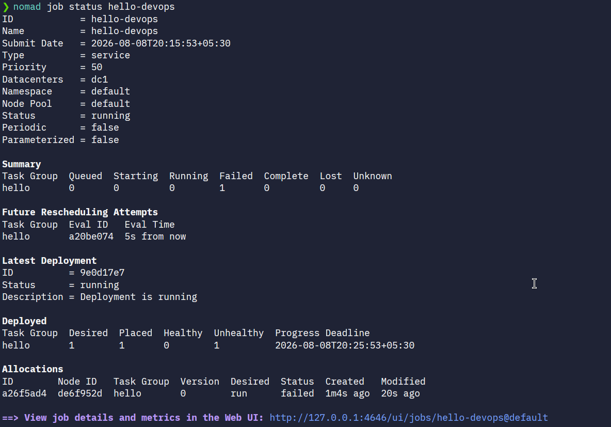

6. **Monitoring with Loki (loki/loki-config.yaml)**

Every step taken to set up Loki is documented in the `monitoring/loki_setup` file.

- **Loki Installation**

  Loki was run locally using Docker.

  The Loki configuration file was downloaded using:

  ```bash
  curl -L https://raw.githubusercontent.com/grafana/loki/v3.7.0/cmd/loki/loki-local-config.yaml -o loki-config.yaml
  ```

  Loki was started using:

  ```bash
  docker run \
    --name loki \
    -d \
    -v "$(pwd):/mnt/config" \
    -p 3100:3100 \
    grafana/loki:3.7.0 \
    -config.file=/mnt/config/loki-config.yaml
  ```

- **Verify Loki**

  Loki readiness was checked using:

  ```bash
  curl http://localhost:3100/ready
  ```

  Expected output:

  ```text
  ready
  ```

- **Docker Log Forwarding**

  The Loki Docker logging driver was installed using:

  ```bash
  docker plugin install grafana/loki-docker-driver:3.7.0-amd64 \
    --alias loki \
    --grant-all-permissions
  ```

- **Test Log Forwarding**

  A Docker container was started with:

  ```bash
  docker run --rm \
    --add-host=host.docker.internal:host-gateway \
    --log-driver=loki \
    --log-opt loki-url="http://host.docker.internal:3100/loki/api/v1/push" \
    alpine:latest \
    sh -c 'echo "Hello from Loki"; sleep 2'
  ```

- **Viewing Logs**

  Loki exposes its HTTP API on:

  ```text
  http://localhost:3100
  ```

  The labels endpoint can be queried using:

  ```bash
  curl http://localhost:3100/loki/api/v1/labels
  ```

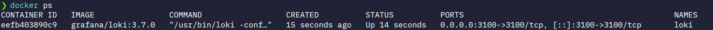
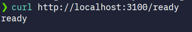
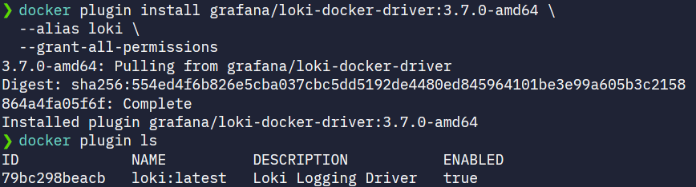
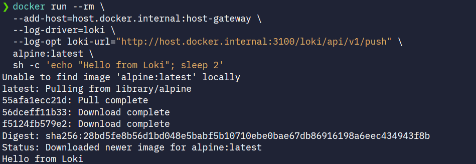
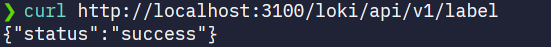
